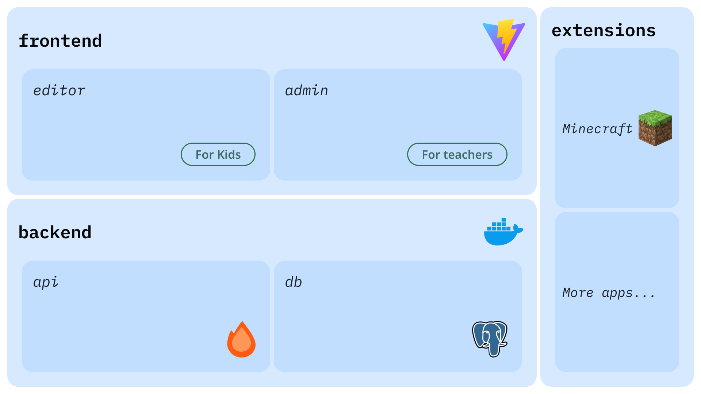

import {
  Aside,
} from "@astrojs/starlight/components";

## TutoriaLLMのリポジトリ構成

TutoriaLLMには、フロントエンドとバックエンドの２つのシステムがあります。フロントエンドは、React+Vite+Tanstack Router で構築されており、バックエンドは、Hono+Node.js で構築されています。また、データベースとして PostgreSQLを使用しています。
また、これらのシステムに加え、拡張機能を提供するExtensionシステムがあります。これにより、Minecraftなど外部のアプリケーションと連携する機能を構築することができます。
アプリケーションをホストするためには、Dockerまたは任意のPaaSを使用して、デプロイを行う必要があります。

<Aside type="note" title="専門的な知識が必要です">
TutoriaLLMをホストするには、フロントエンドとバックエンドの両方の専門的な知識が必要です。
</Aside>

### フロントエンド(apps/frontend)

フロントエンドは、React+Vite+Tanstack Router で構築されています。任意のエディタを使用してコードを編集し、Node.jsを利用したローカル環境でアプリを利用することができます。

### バックエンド(apps/backend)

バックエンドは、Hono(OpenAPI対応)+Node.js で構築されており、データベースにはDrizzle、フロントエンドとの通信にはSocket.ioを利用しています。ユーザーの進捗、認証情報、チュートリアルを保存するデータベースとして PostgreSQLを使用する必要があります。また、画像や音声などを保存する目的のストレージとしてS3(またはS3互換のサービス)と接続する必要があります。バックエンドは、フロントエンドと連携して、アプリケーションのデータを管理します。
このページでは、開発目的のために、ローカル環境でアプリを利用する方法を説明します。

### ドキュメンテーション(apps/docs)

ドキュメンテーションは、Astro+Starlight で構築されています。APIリファレンス(自動生成)や、チュートリアルの作成方法などを記載しています。

### 拡張機能(packages/extensions)

拡張機能は、デフォルトでは`/packages/extensions`に配置されています。コード実行時の挙動や、ブロックの追加などを行うことができます。
