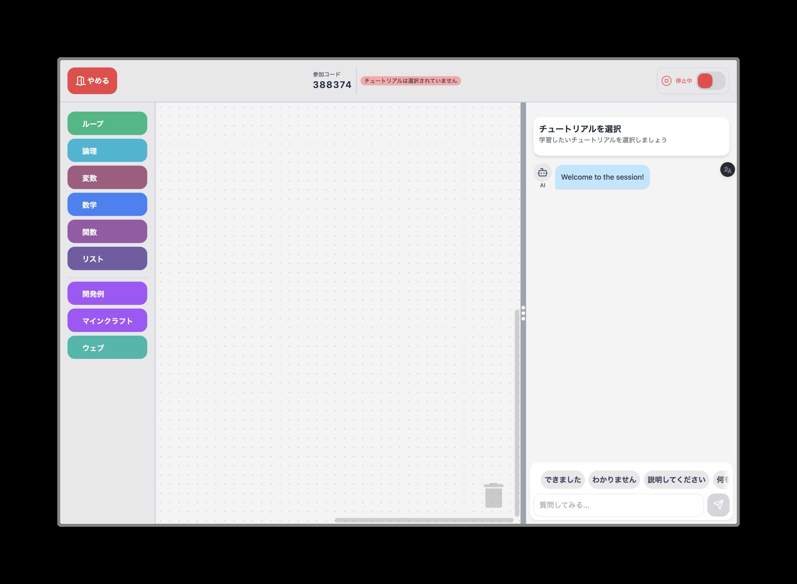
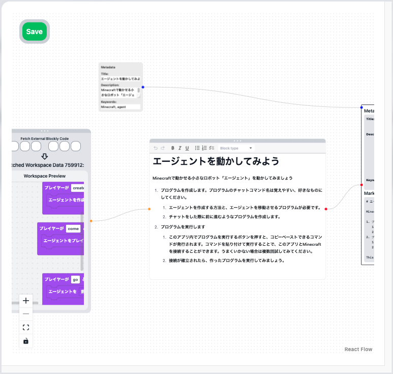
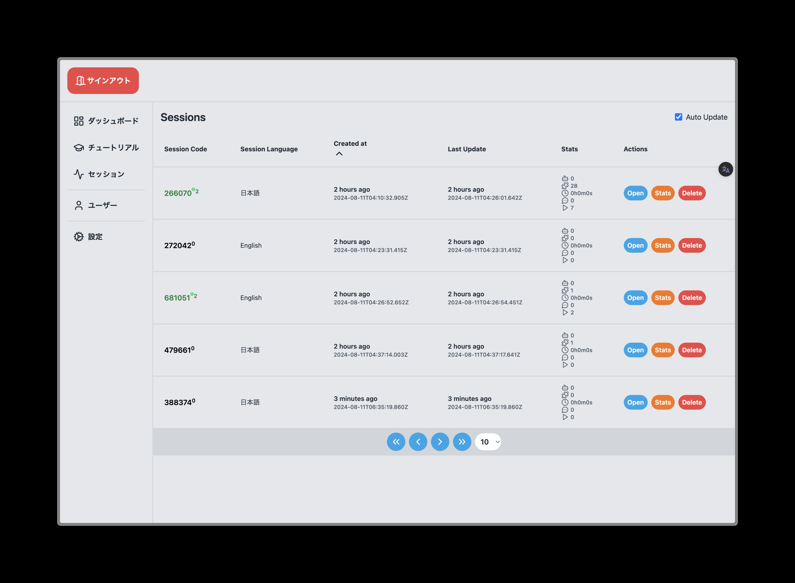

import {
  LinkCard,
  Card,
  CardGrid,
  Aside,
  Icon,
} from "@astrojs/starlight/components";

TutoriaLLM is a self-hosted programming learning platform using LLM, available on the web. This platform is designed for those who create educational content and those who learn from it.

<Aside type="caution" title="Caution">
  TutoriaLLM is software for creating tutorial-providing websites on servers and
  is not the name of a standalone application. Anyone can host an application
  that provides tutorials using TutoriaLLM.
</Aside>

## Features

<iframe
  class="iframe-video"
  src="https://www.youtube.com/embed/zVqjqdK0cPQ?si=DrO7nj0r4YHptH-A"
  title="YouTube video player"
  frameborder="0"
  allow="accelerometer; autoplay; clipboard-write; encrypted-media; gyroscope; picture-in-picture; web-share"
  referrerpolicy="strict-origin-when-cross-origin"
  allowfullscreen
></iframe>

With this platform, you can easily create programming tutorials and provide them to learners. Both the tutorial creators and users can enjoy a better learning experience through this app.

### For Learners

Users who access the tutorials can learn the basics of programming through interactive sessions with the LLM (AI) via an intuitive interface. All that's required is a web browser, and since sessions are managed server-side, you can resume from any device.

Additionally, programs created in tutorials are executed server-side and can integrate with other applications. Currently, integration with Minecraft is supported, allowing you to run your programs.

> The images shown are from the development phase and may differ from the actual interface.

### For Tutorial Creators

Editors creating tutorials can utilize powerful tools to create tutorials in a short time. The tutorials you create can be provided to users on the TutoriaLLM platform.
You can build a custom tutorial app using TutoriaLLM on your own domain, enabling you to offer original educational content.

> The images shown are from the development phase and may differ from the actual interface.

Additionally, editors can track the progress of users in real time and monitor their actions.

## Try It

### Try the Demo

If you are new to programming, try the demo first. You can experience the features of the app through this demo.

<LinkCard
  title="Try the Demo"
  description="Experience the TutoriaLLM demo."
  href="https://demo.tutoriaLLM.com"
/>
 

### Join the Community

Join the TutoriaLLM community and interact with other users. Participate in the Discord server and get the latest updates.

<LinkCard
  title="Discord Server"
  description="Join the TutoriaLLM community."
  href="https://discord.gg/zxuREnWVXC"
/>

### Host TutoriaLLM

If you would like to create and publish your own tutorials, you can use TutoriaLLM to build your own dedicated application. Learn how to create it through the guide below.

<LinkCard
  title="Development - Quick Start"
  description="Learn how to create an application using TutoriaLLM."
  href="/en/developer/host"
/>
