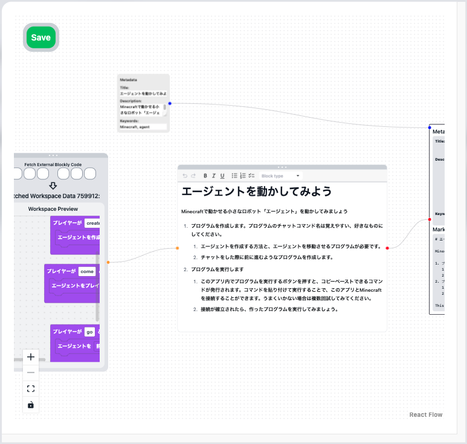
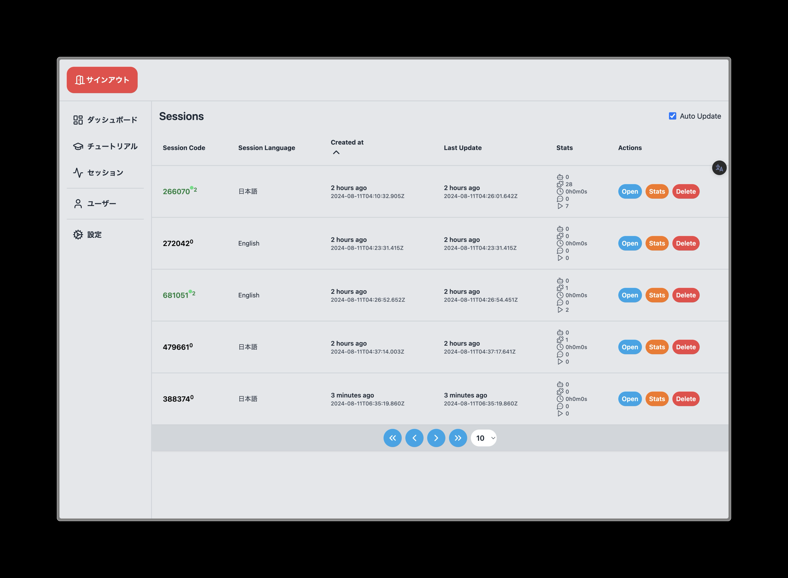

import {
  LinkCard,
  Card,
  CardGrid,
  Aside,
  Icon,
} from "@astrojs/starlight/components";

TutoriaLLM（チュートリアル LM）は、Web 上で利用できる、LLM によるセルフホスト型のプログラミング学習プラットフォームです。このプラットフォームは、教育コンテンツを作成する方と、そのコンテンツから学ぶ方々のために設計されています。

<Aside type="caution" title="注意">
  TutoriaLLMは、サーバー上でチュートリアルを提供するサイトを作成するためのソフトウェアであり、単独のアプリケーションの名称ではありません。TutoriaLLMを利用して、チュートリアルを提供するアプリケーションを誰でもホストすることができます。
</Aside>

## 特徴

<iframe
  class="iframe-video"
  src="https://www.youtube.com/embed/-EubeJrnn70?si=BDjkakbLhWRao7sy"
  title="YouTube video player"
  frameborder="0"
  allow="accelerometer; autoplay; clipboard-write; encrypted-media; gyroscope; picture-in-picture; web-share"
  referrerpolicy="strict-origin-when-cross-origin"
  allowfullscreen
></iframe>

このプラットフォームを使えば、プログラミングに関するチュートリアルを簡単に作成し、それを学ぶ方々に提供することが可能です。チュートリアルを作成する人も利用する人も、このアプリを通じてより良い学習体験を得ることができます。まずは以下のスライドをご覧ください。

  <iframe
    src="https://docs.google.com/presentation/d/1PYHkX_mpfPebbhWHdUw9v0uklFfV1K9j07MLMhHmT4k/embed?start=false&loop=false&delayms=3000"
    style="position: absolute; top: 0; left: 0; width: 100%; height: 100%;"
    frameborder="0"
    allowfullscreen="true"
    mozallowfullscreen="true"
    webkitallowfullscreen="true"
  ></iframe>

### チュートリアルを学ぶ人

チュートリアルを利用するユーザーは、直感的な操作画面を通じて、LLM（AI）との対話型セッションでプログラミングの基礎を学ぶことができます。必要なのは Web ブラウザのみで、セッションはすべてサーバー側で管理されるため、どのデバイスでも途中から再開可能です。

さらに、チュートリアルで作成したプログラムはサーバー側で実行され、他のアプリケーションと連携することもできます。現在、Minecraftとの連携が可能で、プログラムを実行することができます。

> 画像は開発中のもので、実際の画面とは異なる場合があります。

### チュートリアルを作成する人

チュートリアルを作成する編集者は、強力なツールを使って、短時間でチュートリアルを作成できます。作成したチュートリアルは、TutoriaLLM プラットフォーム上でユーザーに提供することができます。
自社のドメイン上で TutoriaLLM を利用して、独自のチュートリアルアプリを構築することで、オリジナルの教育コンテンツを提供することが可能です。

> 画像は開発中のもので、実際の画面とは異なる場合があります。

また、エディターはユーザーの進行状況をリアルタイムで追跡でき、どのような操作を行っているかを確認できます。

## 使ってみる

### デモを試す

プログラミング初心者の方は、まずデモをお試しください。このデモを通じて、アプリの機能を体験できます。

<LinkCard
  title="デモを試す"
  description="TutoriaLLMのデモを体験しましょう。"
  href="https://demo.tutoriaLLM.com"
/>

### コミュニティに参加する

TutoriaLLM のコミュニティに参加して、他のユーザーと交流しましょう。Discord サーバーに参加して、最新情報を入手しましょう。

<LinkCard
  title="Discord サーバー"
  description="TutoriaLLMのコミュニティに参加しましょう。"
  href="https://discord.gg/zxuREnWVXC"
/>

### TutoriaLLM をホストする

もしご自分でチュートリアルを作成して公開したい場合は、TutoriaLLM を使って専用のアプリケーションを作成しましょう。以下のガイドで作成方法を学べます。

<LinkCard
  title="開発 - クイックスタート"
  description="TutoriaLLM を使ってアプリケーションを作成する方法を学びましょう。"
  href="/developer/repo"
/>
